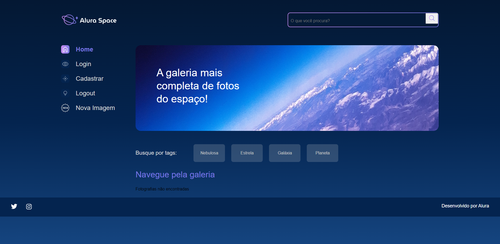

# 🪐 Alura Spaces
Alura spaces is a website which you can register images from your favorites celestial corpuses.

## 💻 Skills and techs used
- `Python`
- `Python OOP`
- `Django`
- `HTML`
- `CSS`
- `AWS S3`
- `Github Issues`

## 🛠️ Open and run project

To run the project you must have Python 3.10. You can get the installation right <a href="https://www.python.org/downloads/release/python-3100/" target="_blank">here</a>. After installed python, you have to run this command line:
`pip install -r requirements.txt`

If you don't have pip, you can install right <a href="https://pip.pypa.io/en/stable/installation/" target="_blank">here</a>.

**IMPORTANT**: You must create a .env file to put your Django secret key and your AWS Keys.

After steps above, run: `python manage.py collectstatic` to upload the static files to S3.

To run the application, run `python manage.py runserver` and access the url: http://localhost:8000/
